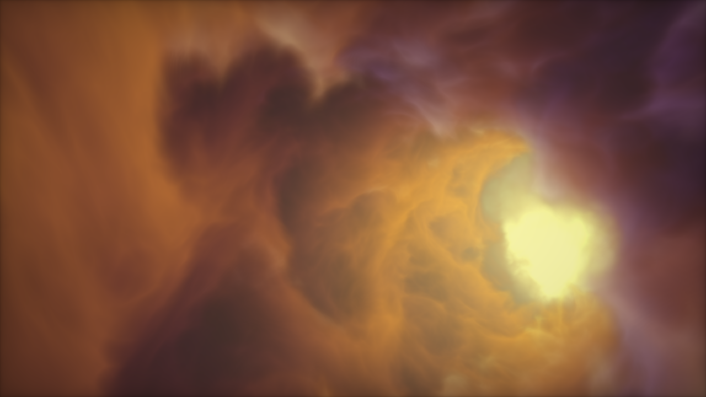

<!-- _footer: "three.js | thebookofshaders | blender | shadertoy" -->


# Shaders
### Textures, Lumières et Ombres

---

# Uniforms

```glsl
float     time
vec2      mouseCursor
vec3      lightPosition
sampler2D texture
```

---

# Exercice

Faire cycler la couleur d'un quad au cours du temps.

---

# UVs

Expliquer avec Blender

---

# Exercice

Animer la texture de l'eau.

---

# Composabilité des shaders

**Three.js** assemblent leur sections de code via leur système de [ShaderChunk](https://threejs.org/docs/?q=shader#api/en/renderers/shaders/ShaderChunk)

**Unity** propose leur *Universal Render Pipeline* avec les [Shaders URP](https://docs.unity3d.com/Packages/com.unity.render-pipelines.universal@8.2/manual/writing-shaders-urp-basic-unlit-structure.html).

**Blender** utilise un système de *nodes* dans l'onglet Shading, appellé [Shader Editor](https://docs.blender.org/manual/en/latest/editors/shader_editor.html).

---

# Exemples de shaders

- UV (tileset shader)
- Force Field (perlin noise)
- Particles (life cycle)
