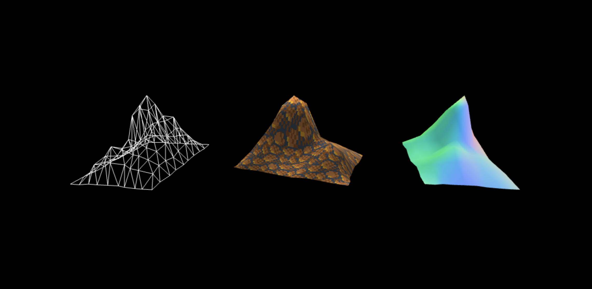

<!-- _footer: "three.js | thebookofshaders | blender" -->


# Les bases de la Pipeline 3D

---

Cette présentation va se concentrer sur la pipeline **OpenGL** et s'appuyer sur `three.js` pour simplifier le rendu.

Les concepts se généralisent aux moteurs 3D, aux logiciels de modélisation, et aux environnements 3D.

---

# La Pipeline la plus simple

Comment passe-t-on d'un écran noir, d'une `<canvas>`, à une simple couleur rouge sur l'ensemble de l'écran ?

```
Basic Quad -> Vertex Shader -> Fragment Shader -> Render
```

---

# Qu'est-ce qu'un Basic Quad

Qu'est-ce qu'un vertex ?
Comment sont-ils assemblés en triangles (*faces*) ?
Comment sont-ils affichés à l'écran ?

---

# Comment fonctionne la pipeline 3D moderne

---

### Geometry
Une collection de points dans l'espace 3D, au format `vec3`, un array de 3 nombres float

```
[
  -1.0, -1.0, 1.0,
   1.0, -1.0, 1.0,
   1.0,  1.0, 1.0,
  -1.0,  1.0, 1.0,
]
```

---

### Material
Un Shader et ses `uniforms`

- une texture 2D ou 3D
- un vecteur 3d ou 4d

---

# Récap

1. Geometry
2. Material
    1. Vertex Shader
    2. Fragment Shader
3. Mesh

---

# Vertex Shader 

Sert à calculer la position de chaque vertex sur l'écran, et définir des valeurs qui seront employées plus tard dans le `Fragment Shader`.
- Calculé une fois pour chaque vertex
- Interpolé pour toutes les autres positions
- Gère la projection de la caméra
- Doit retourner la position du vertex évalué

---

# Code d'un Vertex Shader

```glsl
void main(){
  vec4 modelViewPosition = modelViewMatrix * vec4(position, 1.0);
  gl_Position = projectionMatrix * modelViewPosition;
}
```

[Three.js | Built-in uniforms and attributes](https://threejs.org/docs/?q=shader#api/en/renderers/webgl/WebGLProgram)

```
modelViewMatrix = Matrice de la Camera * Matrice de l'Objet
projectionMatrix = Projection de la Camera
```

---

# Fragment Shader

Aussi appellé *Pixel Shader*. 

- Il est appellé pour *chaque pixel* visible de chaque triangle de l'objet
- Hérite de plusieurs variables lui permettant toute sorte d'effets (textures, lumières, ombres, transparence)
- Doit retourner la couleur du pixel

---

# Code d'un Fragment Shader

L'exemple le plus simple, un shader qui rend l'objet **rouge** et **opaque**.

```glsl
void main(){
  gl_FragColor = vec4(1., 0, 0, 1.);
}
```

---

```
Vertex Shader + Fragment Shader = Material
```

---

```
Geometry + Material => Mesh
```

---

## Prochainement
- UVs
- Procedural terrain
- Procedural rocks

---

# Références

### three.js

- [Creating a scene](https://threejs.org/docs/#manual/en/introduction/Creating-a-scene)
- [BufferGeometry](https://threejs.org/docs/#api/en/core/BufferGeometry)
- [ShaderMaterial](https://threejs.org/docs/#api/en/materials/ShaderMaterial)

### Shaders

- [The Book of Shaders](https://thebookofshaders.com/)