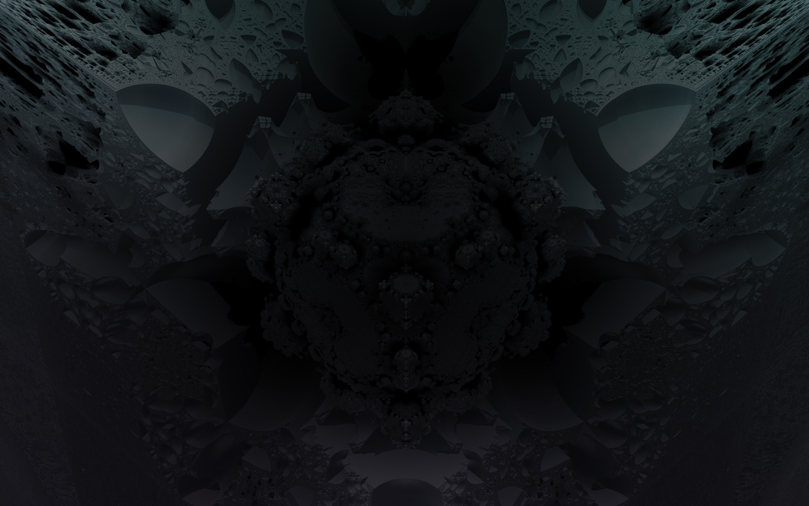

<!-- _class: "cover" -->

# Génération  Procédurale
## Faire émerger des  mondes du chaos

---

# Sommaire

1. Textures procédurales
    1. Le lien entre Level Designer et Développeur
    2. Méthodologie de base
    3. Sources de Chaos
    4. Shader procédural
2. Niveaux procéduraux
    1. S'inspirer des jeux de plateau
    2. Définir une logique claire avant de coder

---

#### Le lien entre 
# Level Designer et Développeur

---

# Méthodologie de base

### Instanciation d'un GameObject

Établir une logique simple à suivre, pour instancier notre GameObject à partir d'un asset facile à créer et éditer.
> Exemple : une image 1bit, noir ou blanc, nous donne une carte simple des murs à placer dans un niveau.

---

# Exemple

`Grayscale texture → Level`

Avec 4-5 valeurs de gris, un level designer peut créer un nouveau niveau très vite.
Le développeur peut se concentrer sur l'implémentation séparément.

[Voir la Technique détaillée](https://x.com/unitygames/status/1460670875783602176)

---

# Exemple

`Vertex Painting → Terrain Texture`

Dans l'éditeur de jeu, le level designer peut peindre chaque vertex d'une couleur spécifique.

Le développeur peut utiliser cette valeur faire varier le terrain en utilisant un seul mesh.

---

# Exemple

`Vertex Painting → Terrain Texture`

Ici le développeur utilise chaque channel (RGBA) pour y attribuer une texture différente et reproduire un terrain naturel.

> Si le vertex est Rouge, peindre le chemin. Si le vertex est Bleu, peindre de l'herbe, etc.

---

# Laisser le contrôle à un générateur procédural

---

# Méthodologie de base

### Création procédurale d'un asset

Utiliser de l'aléatoire, du bruit, des patterns pour créer des valeurs, puis leur appliquer des règles pour contrôler le résultat et s'assurer que l'asset final reste cohérent.
> Exemple : utiliser du Perlin Noise pour créer des clusters d'obstacles, puis effacer certaines zones si elles bloquent le gameplay (sorties, portes, etc.).

---

# Types de Bruit

> Random, Perlin, Voronoi,
> Fractal Brownian Motion

En combinant, déformant et en animant ces sources de chaos, un tech artist peut reproduire des phénomènes naturels tels que les caustiques de l'eau, la pluie, le feu, ou créer de fausses particules à moindre coût.

---

---

#### Exemple d'application
# Plaine

Pour créer notre plaine en pixel art, on souhaite reproduire la technique de l'époque qui alternait entre 2 tiles pour donner de la diversité.

Pour commencer, on créé le terrain avec une seule texture, que l'on répète sur 16 tiles.

Il nous faut à présent une méthode pour obtenir :
- Tile A ou Tile B
- de manière aléatoire
- mais déterministe

---

#### Exemple d'application
# TileMap

On créé donc une map 1bit de 16 pixels de côté. Pour simplifier, on la remplit de manière aléatoire.

---

#### Exemple d'application
# Shader

On peut maintenant utiliser cette *tilemap* comme `uniform sampler2D`, pour mélanger les deux textures. 
- Si la tilemap retourne **noir**, peindre la **texture A**
- Si la tilemap retourne **blanc**, peindre la **texture B**

---

# S'inspirer des jeux de plateau

<!-- _footer: "Carcassonne, le jeu de société" -->

---

# Définir une logique claire avant de coder

En considérant un zone de départ et une zone de fin pour le niveau, comment souhaite-on voir le joueur évoluer ?

- Limiter la complexité en simplifiant vers de la 2D
- Créer des règles pour contrôler le chaos

---

# Aller plus loin

## Tech Artists à suivre

- [SULLY](https://x.com/artofsully/status/1783278358505161053), Mojang Tech Artist et Indie
- [Oskar Stålberg](https://x.com/OskSta/status/1448248658865049605), créateur de Bad North et Townscaper
- [CitizenCon 2954: Brave New Worlds](https://www.youtube.com/watch?v=wYvPpQ25XGc), StarCitizen Genesis team

---

# Méthodes de génération

## Éditeurs de niveau

- [LDTK](https://ldtk.io/docs/general/editor-components/), par l'un des devs de Dead Cells
- [Tiled Map Editor](https://www.mapeditor.org/)

## Algorithmes

- [Cellular Automaton (Game of Life)](https://en.wikipedia.org/wiki/Cellular_automaton)
- [Wave Function Collapse algorithm](https://github.com/mxgmn/WaveFunctionCollapse)
